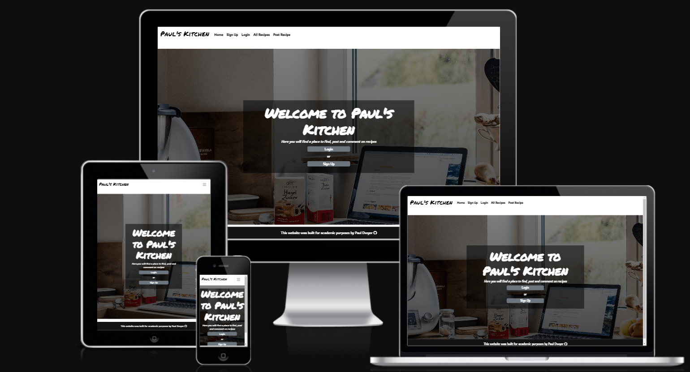
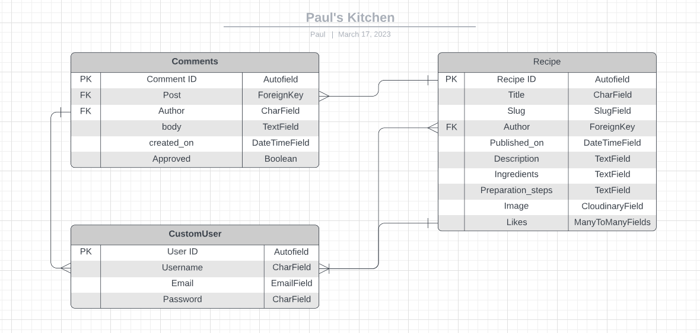

# Pauls Kitchen - Introduction

Personal project 4 for Code Institue Full-Stack Development program. This project is a Full Stack website built using the Django Framework. 

Pauls Kitchen is a blog style website where users can look at the recipes that were posted on the site. 
Users can create an account and post recipes that they would like to share. 
Users can comment on recipes and also like recipes that they like. Users have a profile page that shows all the recipes that a user has posted and liked.

The live link can be found here - https://pauls-kitchen.herokuapp.com/

## Scope

The scope of this project was to build a Full-Stack site based on business logic used to control a centrally-owned dataset. Set up an authentication mechanism and provide role-based access to the site's data or other activities based on the dataset

## Features

In this section i will talk about Existing Features and Future Features planned.

### Existing Features

#### Home Page

- Greeted with a Nav Bar, Hero Image and a Footer
- 

## UX

### User Stories

## Design

For the desgin i leaned into the name of the site. Paul's Kitchen. Paul's Kitchen so essentially my kitchen. I wanted to make it an extenstion of myself.

So thats why i kept the design mininal. Black font against white background. As if the recipes are written on a type of white board with black marker.

Black footer with white writing for contrast against the body.

Font for headings i went with [Permenant Marker](https://fonts.google.com/specimen/Permanent+Marker?query=Marker)
Font for all other text i used [Rowdies](https://fonts.google.com/specimen/Rowdies?query=rowdies)

Hero-Image I choose a laptop in a kitchen. I thought it works well with the theme.

## Database Schema

### Wireframes

## Frameworks, Languages, Libaries and Programmes Used

- [Python](https://www.python.org/downloads/release/python-3811/)

- [CSS](https://developer.mozilla.org/en-US/docs/Web/CSS)

- [JavaScript](https://www.javascript.com/)

- [HTML5](https://html.com/html5/)

- [GitPod](https://gitpod.io/) - Site was developed using GitPod in broswer IDE.

- [GitHub](https://github.com/) - Repository and version control was hosted with GitHub.

- [Django](https://www.djangoproject.com/) - Site was built with Django framework

- [Bootstrap](https://getbootstrap.com/) - Used to style the site and make it responsive on all devices.

- [AllAuth](https://django-allauth.readthedocs.io/en/latest/) - Ued to authenticate login/logout

- [Gunicorn](https://gunicorn.org/) - Python server for WSGI applications

- [ElephantSQL](https://www.elephantsql.com/) - Used for database hosting

- [Cloudinary](https://cloudinary.com/?&utm_campaign=1329&utm_content=instapagelogocta-selfservetest) - Used to host images

- [Summernote](https://summernote.org/) - Used to style text input boxes

- [Heroku](https://dashboard.heroku.com/login) - Site deployed on Heroku.

- [Lucid Charts](https://www.lucidchart.com/) - Used for project planning.

# Testing

For all testing refer to [Testing.md](testing.md) 

## Bugs

# Deployment

## How this Project was Deployed

This project was developed in GitPod.

The repository was hosted on GitHub and was created using Code Institutes template.

The project was deployed on Heroku using the [Code Institue Cheat Sheet](https://codeinstitute.s3.amazonaws.com/fst/Django%20Blog%20Cheat%20Sheet%20v1.pdf)

## Cloning the repository

1. Visit Choose-your-adventure respository. https://github.com/Pauldwyer/Pauls-Kitchen-pp4

2. Click the "Code" dropdown box above the repository's file explorer.

3. Under the "Clone" heading, click the "HTTPS" sub-heading.

4. Click the clipboard icon, or manually copy the text presented: https://github.com/Pauldwyer/Pauls-Kitchen-pp4.git

5. Open your preferred IDE.

4. Ensure your IDE has support for Git or has the relevant Git extension.

7. Open the terminal, and create a directory where you would like the Repository to be stored.

8. Type git clone and paste the previously copied text (https://github.com/Pauldwyer/Pauls-Kitchen-pp4.git) and press enter.

9. The repository will then be cloned into your selected directory.

## Manually Downloading the Repository

1. Visit [Pauls Kitchen](https://github.com/Pauldwyer/Pauls-Kitchen-pp4) respository.

2. Click the "Code" dropdown box above the repository's file explorer.

3. Click the "Download Zip" option; this will download a copy of the selected branch's repository as a zip file.

4. Locate the ZIP file downloaded to your computer, and extract the ZIP to a designated folder in which you would like the repository to be stored.

## Opening the Repository

1. Open your preferred IDE.

2. Navigate to the chosen directory where the Repository was cloned/extracted.

3. You will now have offline access to the contents of the project.

# Credits

