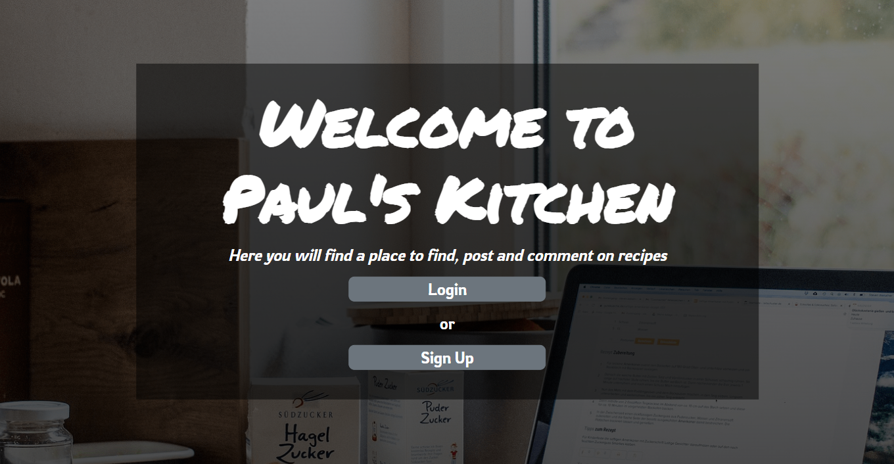
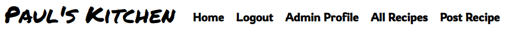
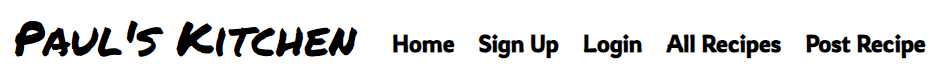
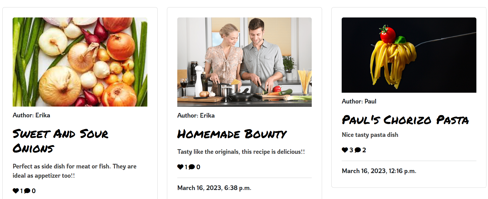
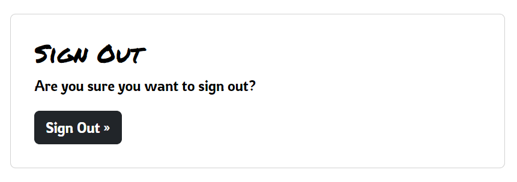
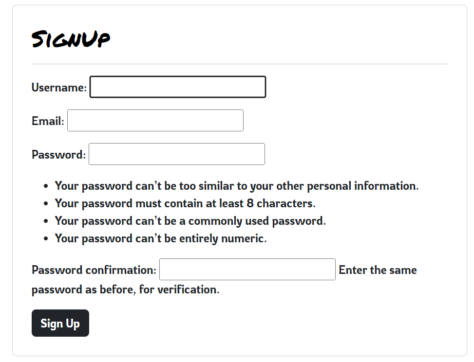
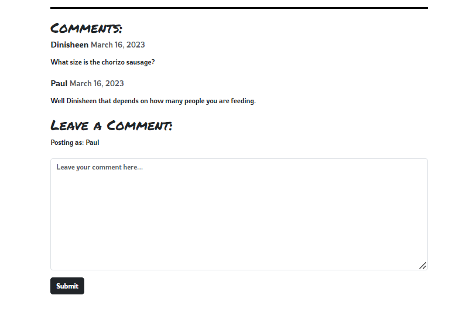
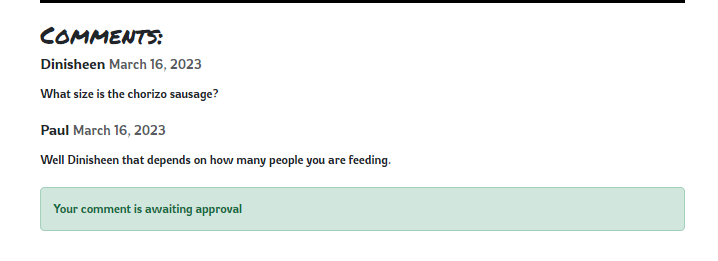
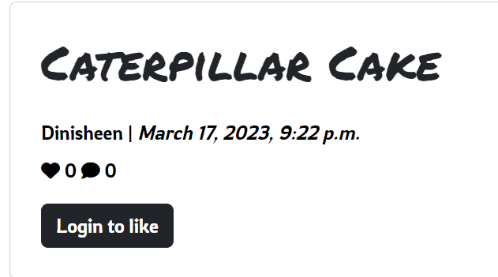

# Pauls Kitchen - Introduction

Personal project 4 for Code Institue Full-Stack Development program. This project is a Full Stack website built using the Django Framework. 

Pauls Kitchen is a blog style website where users can look at the recipes that were posted on the site. 
Users can create an account and post recipes that they would like to share. 
Users can comment on recipes and also like recipes that they like. Users have a profile page that shows all the recipes that a user has posted and liked.

The live link can be found here - https://pauls-kitchen.herokuapp.com/

## Scope

The scope of this project was to build a Full-Stack site based on business logic used to control a centrally-owned dataset. Set up an authentication mechanism and provide role-based access to the site's data or other activities based on the dataset

## Features

In this section i will talk about Existing Features and Future Features planned.

### Existing Features

#### Home Page

- Greeted with a Nav Bar, Hero Image and a Footer
- If the user is not logged in, on the hero image will be a link to login or sign up
- If the user is logged in, the hero image will have a link to the User's Profile page and Post a Recipe

#### Nav Bar

- Nav bar changes based on login status and is fully responsive
- It has the page name and buttons for home, login/logout, signup, all recipes, profile and post a recipe
- If user is on a small device the nav bar get a button to create a drop down menu

#### Footer

- Basic footer that says the site is for educational purposes and links the developers GitHub

#### All Recipes

- All reicpes page shows all recipes posted on the site in paginated format in acscending order based on published date.
- For each recipe in the list you see the author, title, a description, like and comment count and post date.

#### Post A Recipe

- If a unregistered or not logged in user clicks post a recipe link they will be redirected to the log in page.
- If a logged in user clicks the link they will be brought to the form to post a recipe.
- Each text input have a few cutomistaion options like bold, italics, unordered and ordered lists.
- Users can upload an image at the bottom of the form.

#### Authentication

- Sign Up page, Login and Log out pages

#### Recipe Detail Page

- When a user opens a recipe they are greeted with with Recipe Detail page
- The user will see the image that was posted with the recipe
- The user will then see recipe title, author, date posted, like and comment count and a like button.
    - A logged in user who is looking at a recipe they posted will get the option to edit and delete their recipe.
    - A user who isnt logged in will have a button that directs the users to the log in page.
- Below that the user will see the recipe description, ingredients and preparation steps.
- At the bottom of the page is the comment section where users can discuss the recipe
- After a user posts a comment they will get a message saying the comment is awaitng approval.

#### Profile Page

- Link to the profile page as is visible to logged in users. It is on the nav bard and landing page.
- In the profile page users will find all the recipes they post paginated in a rows.
- They will also find all the recipes they like paginated in rows.
- If they user has no posts and hasnt liked any recipes they will get a message saying they havent posted or liked any rcipes.

### Future Features

- Search bar to search for recipes on the site
- Use an API with an external recipe site
- Most liked recipes section / Most Popular
- Sections / Types / Categories - example hot and spicy food
- Add pages to recipe lists
- Expand on the profile page. 
- Notifications in profile for other users comments and likes on your recipes

## UX

## Design

For the desgin i leaned into the name of the site. Paul's Kitchen. Paul's Kitchen so essentially my kitchen. I wanted to make it an extenstion of myself.

So thats why i kept the design mininal. Black font against white background. As if the recipes are written on a type of white board with black marker.

Black footer with white writing for contrast against the body.

Font for headings i went with [Permenant Marker](https://fonts.google.com/specimen/Permanent+Marker?query=Marker)
Font for all other text i used [Rowdies](https://fonts.google.com/specimen/Rowdies?query=rowdies)

Hero-Image I choose a laptop in a kitchen. I think it works well with the theme.

### User Stories

## Database Schema

### Wireframes

## Frameworks, Languages, Libaries and Programmes Used

- [Python](https://www.python.org/downloads/release/python-3811/)

- [CSS](https://developer.mozilla.org/en-US/docs/Web/CSS)

- [JavaScript](https://www.javascript.com/)

- [HTML5](https://html.com/html5/)

- [GitPod](https://gitpod.io/) - Site was developed using GitPod in broswer IDE.

- [GitHub](https://github.com/) - Repository and version control was hosted with GitHub.

- [Django](https://www.djangoproject.com/) - Site was built with Django framework

- [Bootstrap](https://getbootstrap.com/) - Used to style the site and make it responsive on all devices.

- [AllAuth](https://django-allauth.readthedocs.io/en/latest/) - Ued to authenticate login/logout

- [Gunicorn](https://gunicorn.org/) - Python server for WSGI applications

- [ElephantSQL](https://www.elephantsql.com/) - Used for database hosting

- [Cloudinary](https://cloudinary.com/?&utm_campaign=1329&utm_content=instapagelogocta-selfservetest) - Used to host images

- [Summernote](https://summernote.org/) - Used to style text input boxes

- [Heroku](https://dashboard.heroku.com/login) - Site deployed on Heroku.

- [Lucid Charts](https://www.lucidchart.com/) - Used for project planning.

# Testing

For all testing refer to [Testing.md](testing.md) 

## Bugs

- When deploying to heroku i turned Debug to false. when trying to deploy the build wouldnt finish.
    I looked after searching on stack overflow i discovered development = os.environ.get('DEVELOPMENT', False)
    This solved the bug.

- Oringally when a user posted a recipe if it had an apostrophe in the title it would bug out the database. 
    To solve this I add the slugify import and form.instance.slug = slugify(form.instance.title) this fixed the bug.

- HTML tags were bleeding out into rendered templates. To fix this i had to use 'safe' keywords. eg. {{ recipe.ingredients|safe }}

# Deployment

## How this Project was Deployed

This project was developed in GitPod.

The repository was hosted on GitHub and was created using Code Institutes template.

The project was deployed on Heroku using the [Code Institue Cheat Sheet](https://codeinstitute.s3.amazonaws.com/fst/Django%20Blog%20Cheat%20Sheet%20v1.pdf)

## Cloning the repository

1. Visit Choose-your-adventure respository. https://github.com/Pauldwyer/Pauls-Kitchen-pp4

2. Click the "Code" dropdown box above the repository's file explorer.

3. Under the "Clone" heading, click the "HTTPS" sub-heading.

4. Click the clipboard icon, or manually copy the text presented: https://github.com/Pauldwyer/Pauls-Kitchen-pp4.git

5. Open your preferred IDE.

4. Ensure your IDE has support for Git or has the relevant Git extension.

7. Open the terminal, and create a directory where you would like the Repository to be stored.

8. Type git clone and paste the previously copied text (https://github.com/Pauldwyer/Pauls-Kitchen-pp4.git) and press enter.

9. The repository will then be cloned into your selected directory.

## Manually Downloading the Repository

1. Visit [Pauls Kitchen](https://github.com/Pauldwyer/Pauls-Kitchen-pp4) respository.

2. Click the "Code" dropdown box above the repository's file explorer.

3. Click the "Download Zip" option; this will download a copy of the selected branch's repository as a zip file.

4. Locate the ZIP file downloaded to your computer, and extract the ZIP to a designated folder in which you would like the repository to be stored.

## Opening the Repository

1. Open your preferred IDE.

2. Navigate to the chosen directory where the Repository was cloned/extracted.

3. You will now have offline access to the contents of the project.

# Credits

