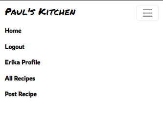
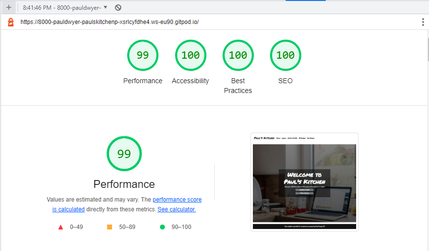
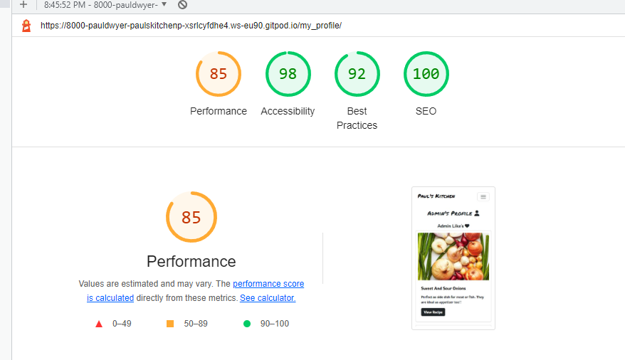
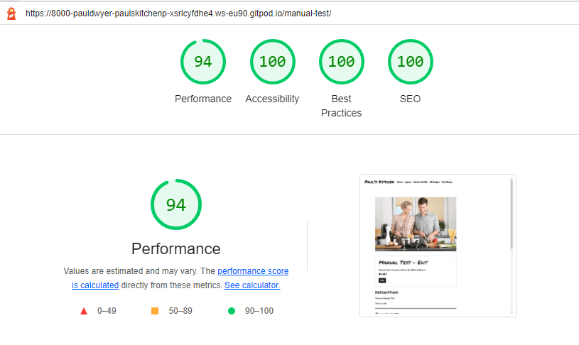

# Testing 

Throughout the development of the project, code was regularly tested using Chrome developer tools, manual testing was performed and code was passed through validators like W3C for HTML, Jigsaw for CSS and Jshint for JS.

List of devices that the website was tested on for responsiveness through chrome developer tools:

- iPhone SE
- iPhone XR
- iPhone 12 Pro
- Pixel 5
- Samsung Galaxy S8
- Samsung Galaxy S20 Ultra
- Samsung Galaxy A51/71
- Samsung Galaxy A52/A53 5g

  
  
  

## Manual Testing

### Sign Up / Log In / Log Out

| Type of Test | Steps |Expected Results | Results
|--------------|-------|------------------|-------
|**Create Account**| Visit https://pauls-kitchen.herokuapp.com/ | Opens the site | Working as intended
|| Click Sign Up button | Opens the Sign Up page | Working as intended 
|| Fill in username, email and password x 2 and click submit | Login page should open | Working as intended
|**Log In**| Log in with just details entered in sign up form | Home page should open | Working as intended
|| Home page should change to reflect a logged in user with | Log out button available | Working as intedned
|**Create account with wrong details** | Visit https://pauls-kitchen.herokuapp.com/ | Opens the site | Working as intended
|| Click Sign Up button | Opens the Sign Up page | Working as intended 
|| Fill in username, email, enter 2 passwords that dont match and click submit | Prompt user to enter matching passwords | Working as intended
|**Log Out** | Navigate to home page and click log out | Logout page should open and ask user are they sure | Working as intended
|| Click Log Out button | Home page should open and Login / Signup buttons available | Working as Intended

### Post a Recipe
| Type of Test | Steps | Expected Results | Results |
| -------------|-------|------------------|---------|
|**Post Recipe with Placeholder** | From Home Page Click Post Recipe button | Open add recipe page | Working as intended
|| Fill all fields with "This is a Manual Test" no image and click submit | Recipe should be posted with placeholder image | Working as intended
|**Post Recipe with Image**| From Home Page Click Post Recipe button | Open add recipe page | Working as intended
|| Fill all fields with "This is a Manual Test 2" click choose file select a image and click submit | Recipe should be posted image selected | Working as intended

### Delete / Edit a Recipe
| Type of Test | Steps | Expected Results | Results |
| -------------|-------|------------------|---------|
|**Edit Recipe**| From Home Page as a logged in user Click "Manual-Test-Account's Profile" Profile Button | Opens profile page for the logged in User | Working as intended
|| Select the Recipe to edit "Manual Test " | When recipe details page opens should be 3 options "Like" "Edit" "Delete" | Working as inteded
|| Click the "Edit" Button | The Edit Recipe form should open | Working as intended
|| Add to all fields "this is a edit" and submit | recipe list should open, a message displays "recipe updated successfully" | Workign as intended
|| Go back into "Manual Test - edit" detail page and update image and then click submit | recipe list should open, a message displays "recipe updated successfully" and image should change | FAIL image didnt change
|**Delete Recipe**| From Home Page as a logged in user Click "Manual-Test-Account's Profile" Profile Button | Opens profile page for the logged in User | Working as intended
|| Select the Recipe to delete "This is a manual Test 2 " | When recipe details page opens should be 3 options "Like" "Edit" "Delete" | Working as inteded
|| Click the "Delete" Button | The delete recipe page should open and user is asked are they sure they want to delete | Working as intended
|| Click the "Delete Button | recipe list should open, a message displays "recipe deleted successfully" | Workign as intended
|| Naviage back to "Manual-Test-Account's Profile" page "This is a manual Test 2 " should be deleted from the site | Working as intedned

## User Story Testing

- Epic Admin
    - As a Site Admin I can create, read, update and delete recipes so that manage the site content
        - For this user story i have a admin panel that allows full CRUD Functionality.
        - 
    - As a Site Admin I can approve or deny comments that have been left by users before they are published so that I can filter out unwanted or irrelevant comments
        - In the Admin panel the admin can approve and unapprove comments. No comment is posted without approval. 
        - 

- EPIC Navigation
    - As a User I can view a paginated list of posts so that I can easily select a post to view
        - Recipe List and Profile pages are paginated.
        - 
    - As a User I can easily navigate the site so that I can find recipes easily
        - Nar bar always displayed allows easy navigation. All pages are in the nav bar.
        - 

- EPIC Interaction
    - As a User I can see the most loved recipes so that I can quickly find inspiration and see which recipes are most famous
        - Not implemented
    - As a User I can like or unlike a post so that I can interact with the content
        - Users have the option to like recipes
        - 
        
    - As a User I can view comments on an individual post so that I can read the conversation
        - Users can view how many comments per recipe on recipe list, profile page and recipe details page.
        - 
        - 

    - As a User I can view the number of likes on each post so that I can see which is the most popular or viral
        - Similar to comments users can see the counts of likes on recipe list, profile page and recipe details page.
        - 

- EPIC User Interaction
    - As a User I can delete / edit my recipe so that I can remove or make changes to my recipes
        - Edit and delete buttons available on recipes that a user has posted.
        - 

    - As a User I can upload an image so that other users can see what my dish looks like
        - At the bottom of the Post Recipe form you have an option to add an image. If you have no image a placeholder is applied
        - 

    - As a User I can post recipes so that other users can see them
        - There is a Post Recipe form for adding recipes to the site
        - 
        - 
        - 

- EPIC Login / Logout / Register
    - As a User I can Register for an account so that I can comment, like and post recipes
        - Custom user model was created so users can sign up, comment, like and post recipes.
        - 

    - As a User I can login or logout off my account so that I can connect or disconnect from the site when I wish
        - Login and Logout forms are availabel for logging in and logging out
        - 
        - 

    - As a User I can easily see if I am logged out so that so that I can be sure what my status is
        - Nav bar buttons change depending on online status. Hero-text also changes. Access to site features also change.
        - You can access profile pages without being logged.
        - Cant post recipes without being logged in.
        - 
        - 
        - 
        - 
        

## Validator Testing

### Lighthouse Testing

See below Chrome Developer tools Lighthouse testing results of all pages on both mobile and desktop.
Low scores for performance mostly because of images. I cant control what format images are uploaed in.

- **Home Page**

- **Recipe List**

- **Profile Page**

- **Post a Recipe**

- **Recipe Detail**

- **Log In / Log Out / Signup**

### [HTML](https://validator.w3.org/)

- **Home Page**

- **Log In**

- **Log Out**

- **Profile**

- **Recipe Details**

- **Recipe List**

- **Sign Up**

### CSS Validation

### CI Python Linter

- **Views.py**

- **Models.py**

- **Urls.py**

- **Forms.py**

- **Admin.py**

As you can see my signup form and post recipe throw up errors.
